# Hyperledger Fabric 1.4 on s309x server

1. Setup and verify of your blockchain environment.
2. Create a blockchain project in Hyperledger Composer.
3. Interact with blockchain and third party APIs through Composer Rest Server and NodeRed.

## Application Overview
This blockchain journey is intended to give you a basic understanding of how a developer would interact with Hyperledger Fabric using Hyperledger Composer. In this workshop you will use a browser based UI to modify chaincode, test your code and deploy your changes. You will also learn how tooling can take the code and generate API to allow for application integration through a REST-ful interface.

## Part 1 — Setting up your server
## Prerequests for server
 - installed curl
 - git

## Installing Hyperledger and composer playgroud
- git clone https://github.com/BlueBarricade/hlfv14-on-s390x
- cd hlfv14-on-s390x
- chmod u+x ./Linux1BlockchainScript.sh
- ./Linux1BlockchainScript
- cd fabric-dev-servers
- ./startFabric.sh
- ./createPeerAdminCard.sh
- open xxx.xxx.x.x:8080 on browser (xxx.xxx.x.x = sever ip)

## Part 2 — Creating a example blockchain application and generating API

#### Importing the components of your blockchain application

1. In a terminal on your computer, move to the home directory. `cd $HOME`

2. If not already installed, [install Git](https://git-scm.com/book/en/v2/Getting-Started-Installing-Git_) for your computer.

3. Once Git is installed, run the following command to clone the needed materials for this exercise. `git clone https://github.com/BlueBarricade/hlfv13-on-s390x`

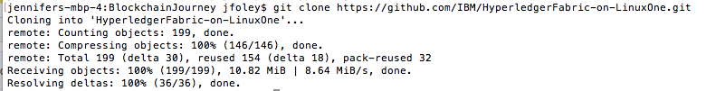

4. To find the files you'll need for this, `cd hlfv4-on-s390x/code/` and then run `ls` to see what is in the directory.

   

5. Enter `pwd` to see where you are on your system. Save this information. You'll need it in a few steps.

   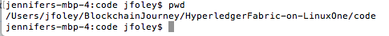

6. Go back to your browser that has Composer Playground open. If you've closed it, you can open it in your browser by entering `xxx.xxx.x.x:8080` into the address bar where the x's correspond to your Linux guest's IP address.

   * **Note:** You will need to view the browser in Full Screen (fully expanded) mode to be able to access everything and prevent issues with inability to scroll on certain screens.

   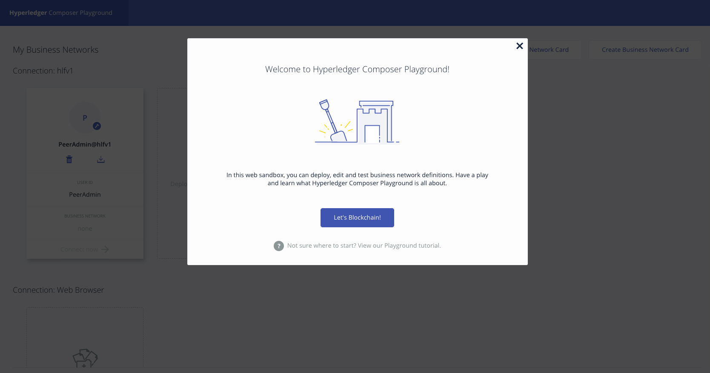

7. Select **Deploy a new business network** under *Connection: Web Browser*.
  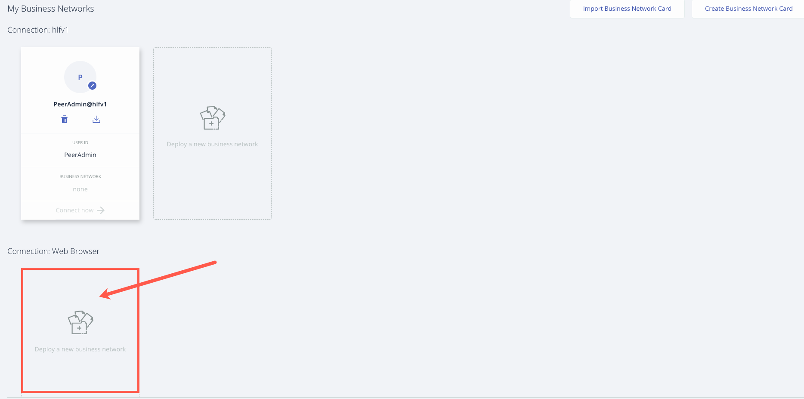

8. Complete the *BASIC INFORMATION*.

   * Give your new Business Network a name: **blockchain-journery**

   * Describe what your Business Network will be used for: **Creating my first blockchain network.**

     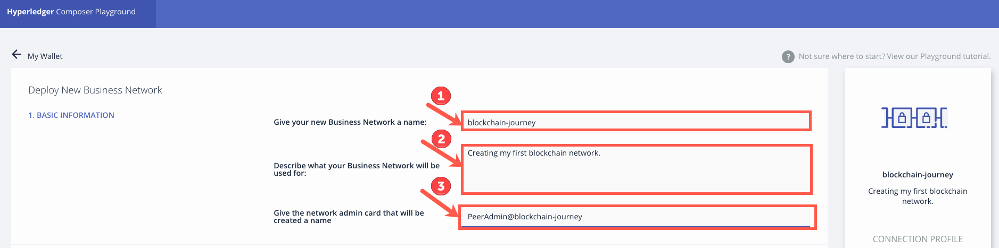

9. Scroll until you can see *Choose a Business Network Definition to start with:* and select **empty-business-network** and **Deploy**.
   

10. * From *My Wallet* select **Connect now** to go into your business network.

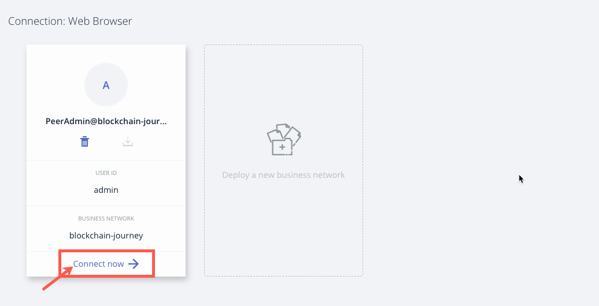

11. Select **Add a File**.

    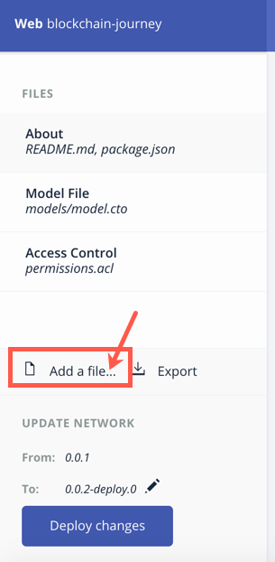

12. From the *Add a file* pop-up dialog, select **browse**.

    

13. In the file explorer window, navigate to where you downloaded the files. Refer to step 5 if you need help finding this location. **Select** *README.md* and **Click** *Open*.
   

14. **Select** *Add*.
   

15. On the *Current file will be replaced* dialog, **select** *Replace*.

16. Let's keep adding the files to the Composer Playground.  **Repeat steps 11-15 to add the following files**:

* *org.acme.sample.cto* — This is located in the models folder. In this exercise you'll use this file to create a model for your asset and transactions. You could also create participants in this file. This is similar to creating a Java class and defining what you would need in the class.

* *logic.js* — This is located in the lib folder. This is a JavaScript file that becomes the brains of your application. In this file is code, your smart contract, that defines how a transaction can happen. This is similar to Java methods.

* **Add last:** *permissions.acl* — This is where you would limit permissions for participants in a blockchain network.

* **Remove model.cto:** -- This is the empty model file that came with the sample. We will delete it to avoid any potential problems.

  * **Click** on model.cto

  * **Click** on the trash can icon to remove it.

    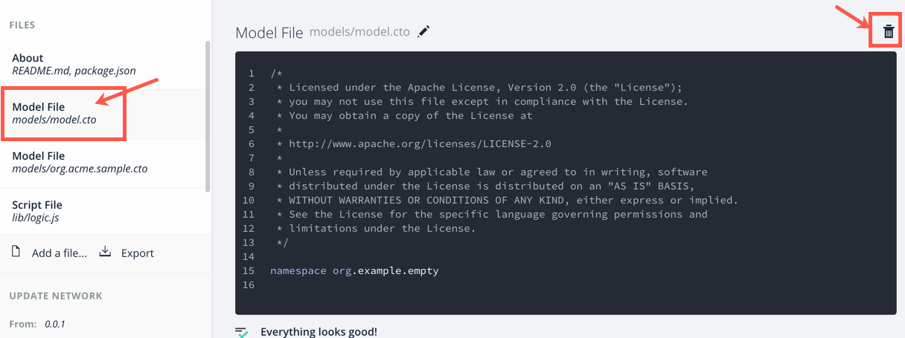

17. Your files are all now loaded into Composer Playground. **Click** *DeployChanges* on the left side of the browser.

   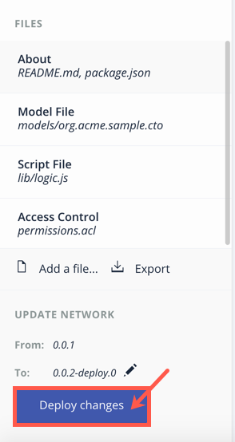

   #### Creating your blockchain application

18. Click on **Model File**.

    

19. Click in the **editor** on the right to begin writing your models.

    * NOTE: **DO** **NOT** modify the namespace during the lab.

      

20. On a new line, give your asset `Sensor` the following attributes.

    * Note: a small "o" is used as a bullet in the model.

    * `o String teamID` — this will be the value that is assigned to your team. (already there!)

    * `o String teamName`— this could be anything! Come up with something clever!

    * `o Double sensorTemp` — temperature from the Raspberry Pi will be stored here.

    * `o Double thermostatTemp`— you will create a temperature for the thermostat.

    * `o String recommendation`— this will be populated based on the `CompareWeather` transaction.

    * **Click** *Deploy Changes* to save changes.

      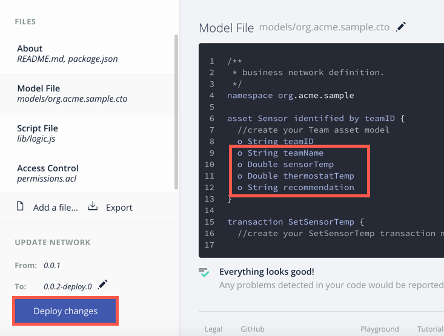

21. Now create your first transaction model for `SetSensorTemp`. Enter the following attributes:

    * `--> Sensor gauge` — The transaction will need to put data into the `Sensor` asset. This passes a reference to the asset so we can work with the asset in the logic for the transaction.

    * `o Double newSensorValue` — This is the variable that will be set by the temperature passed into the transaction from the NodeRed Sensor for picking up temperature.

    * **Click** *Deploy Changes* to save changes.

      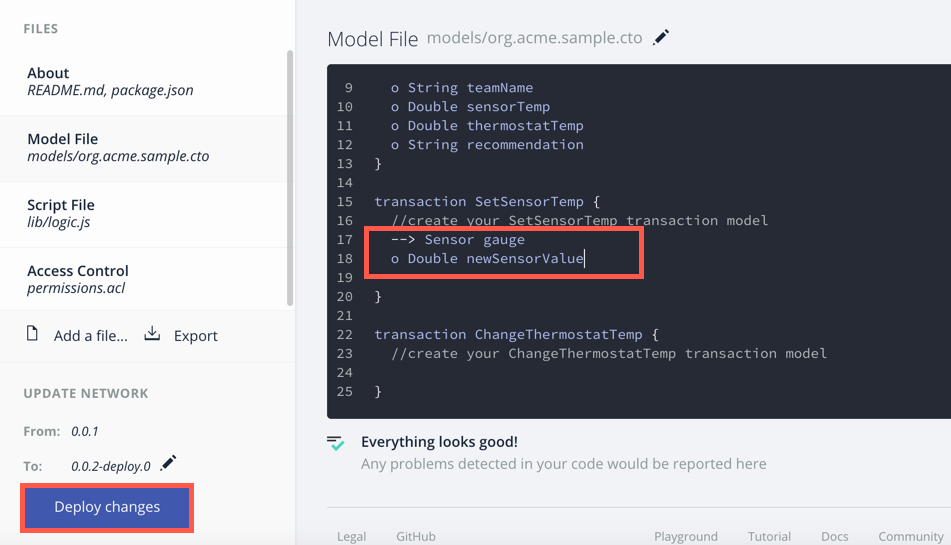

22. Build your `ChangeThermostatTemp` transaction model. Add the following:

    * `--> Sensor thermostat` — The transaction will need to put data into the `Sensor` asset for the thermostat. This passes a reference to the asset so we can work with the asset in the logic for the transaction.

    * `o Double newThermostatValue` — This allows for a new, proposed value to be sent into the transaction. In the logic tab, we will use this value to compare to what the gauge says and decide if the thermostat value should be adjusted.

    * **Click** *Deploy Changes* to save changes.

      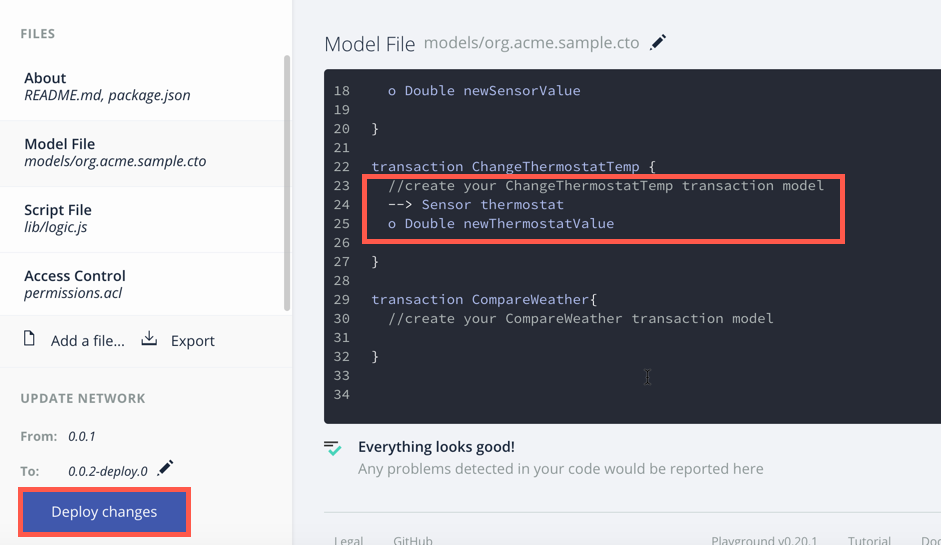

23. Enter the following values to build your `CompareWeather` transaction model:

    * `--> Sensor recommend` — The transaction will need to put data into the `Sensor` asset. This passes a reference to the asset so we can work with the asset in the logic for the transaction.
    * `o Double outsideTemp` — Looking at the [WeatherUnderground.com API](https://www.wunderground.com/weather/api/d/docs?d=data/conditions) for Conditions, you can see all of the possible data that the call could return. Based on the data, it was decided to take the actual outside temperature and the feels like temperature to give a recommendation on thermostat settings. This variable stores the value passed into it via NodeRed from Weather.com for the outside temperature.  The model on the API page shows up whether the data is returned in Celsius or Fahrenheit and its variable type. In this exercise we will use Celsius.

    * `o Double feelsLike`— the variable to store the feels_like value from Weather.com.

    * **Click** *Deploy Changes* to save changes.

      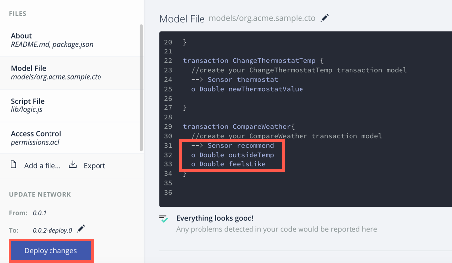

24. Click on the **Script File** tab.

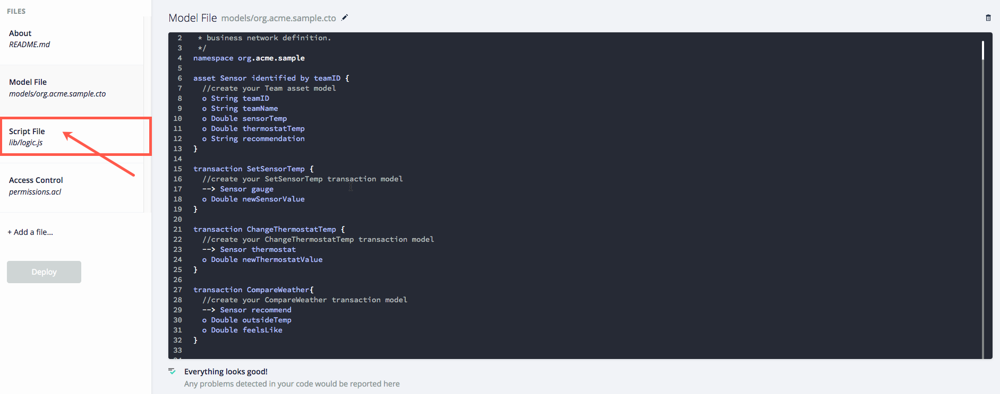

26. **Review the code in the editor. **Verify that your variable names match the variable names here.  Capitalization does matter! If names don't match, you'll have errors.

    * Any guesses what the code is doing for each transaction?

      

    #### Test application code

27. Click on the **Test** tab at the top to try out your code.

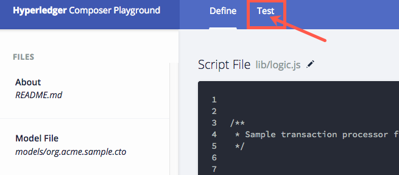

28. Notice that in this particular case because we have no participants, the **Test** tab has opened to the **Asset** menu on the left. You must have an asset to be able to run any of the transactions.

    * Click **Create New Asset**.

      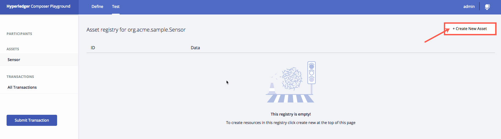

29. Create an example asset to test your code by filling in the following information:

   * `"teamID": "teamID:**xxx**"` where ** **xxx** ** is any team number you'd like.

   * `"teamName":""` — this could be any name you'd like. Be clever! :bowtie:

   * `"sensorTemp": **0**` — Set ** **0** ** to any value. When you work with NodeRed, temperatures will be in Celsius.

   * `"thermostatTemp": **0** `— Set ** **0** ** to any value. This is initializing your thermostat so pick a value you want to work with.

   * `"recommendation": "" `— Leave this as is.

   * *Make a note somewhere** of the values you used for `sensorTemp` and `thermostatTemp`.

     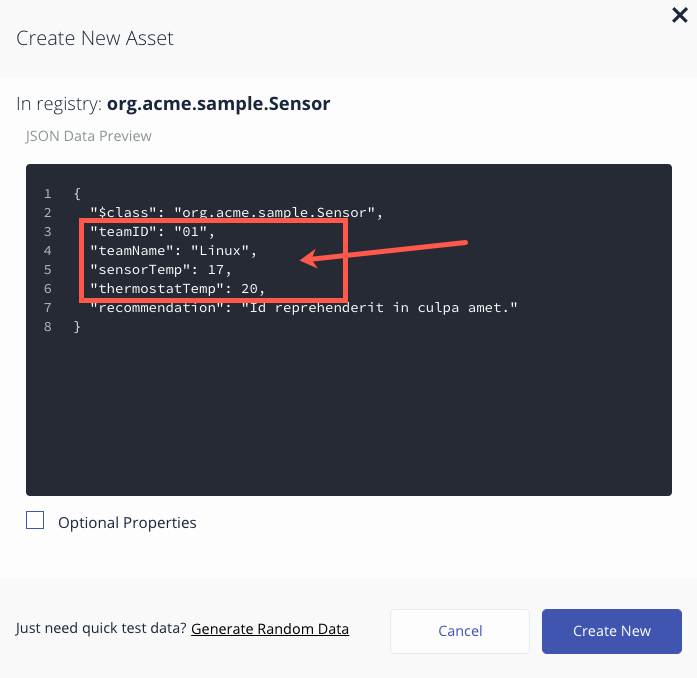

30. Click **Create New**.

   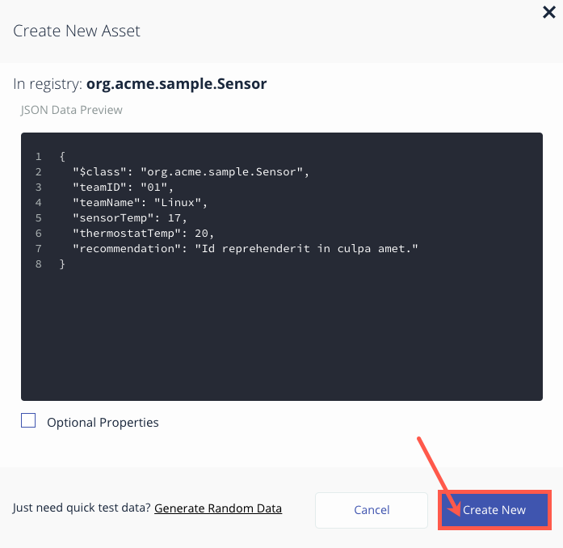

31. Once your **Team** asset is created it should show in the registry as shown below.

    

32. You're ready to run your first transaction. **Click** on *Submit Transaction*.

    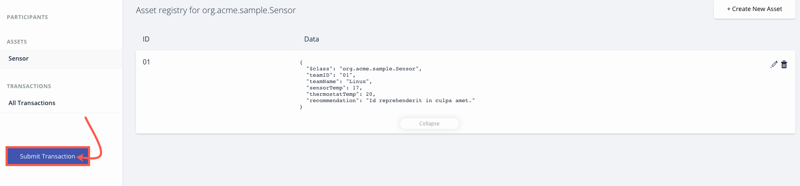

33. The **Submit Transaction** dialog will open a new window.

    * Make sure that the **Transaction Type** is set to `SetSensorTemp`.

    * Modify the JSON data`"gauge": "resource:org.acme.sample.Sensor#xxxx"`  — enter your team's identifier in place of the value where **xxxx** is in the sample JSON data.

    * Modify the JSON data`"newSensorValue": 0` — enter a value your sensor could have.

    * Click **Submit**.

      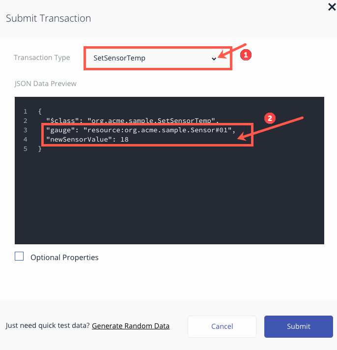

34. If you submitted the transaction with your correct team ID, then you should have a transaction showing under *All Transactions*. **Click view record** to see the data you entered in the prior step. Congratulations! You've now completed a transaction. :thumbsup:

    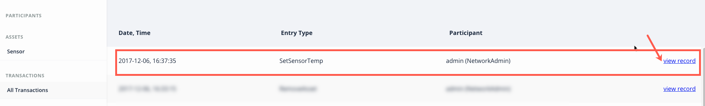

35. Verify that `SetSensorTemp` updated the `sensorTemp`value in your asset. Click **Sensor**.

    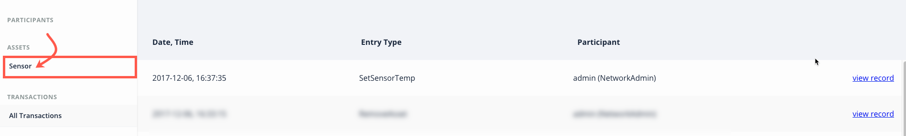

36. Check the `sensorTemp` value. Does it have the new value from the `SetSensorTemp` transaction?

    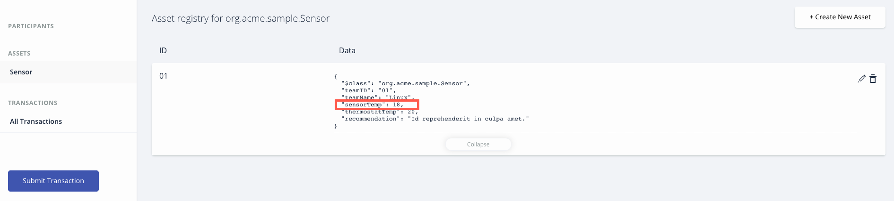

37. Let's do another transaction. Select **Submit Transaction**.

    

38. This time let's run, `ChangeThermostatTemp`.

   * In the **Transaction Type** drop down, select `ChangeThermostatTemp`.
     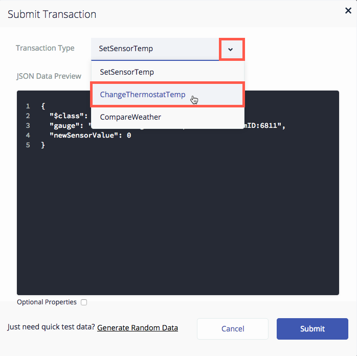

   * Edit the sample JSON for the transaction`"thermostat": "resource:org.acme.sample.Sensor#xxxx"`— change **xxxx** to your team ID value.

   * Edit the sample JSON for the transaction`"newThermostatValue": 0` — Replace **0** with a value to which you would like to see if you can adjust the thermostat.

   * Click **Submit**.

     

   * If you select a temperature for the thermostat that is not within 3 degrees of the `sensorTemp` value, then you will get an error message like the one below. If you get this message, enter another value and click submit.

     

   * If you do have permission to adjust the thermostat, you will be returned back to the transaction registry where you can see the data you just submitted.

     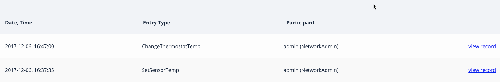

   * If for some reason you forget to modify your teamID value or update it to the wrong value, you will see an error like the one shown below. Check your value for teamID and try again.

     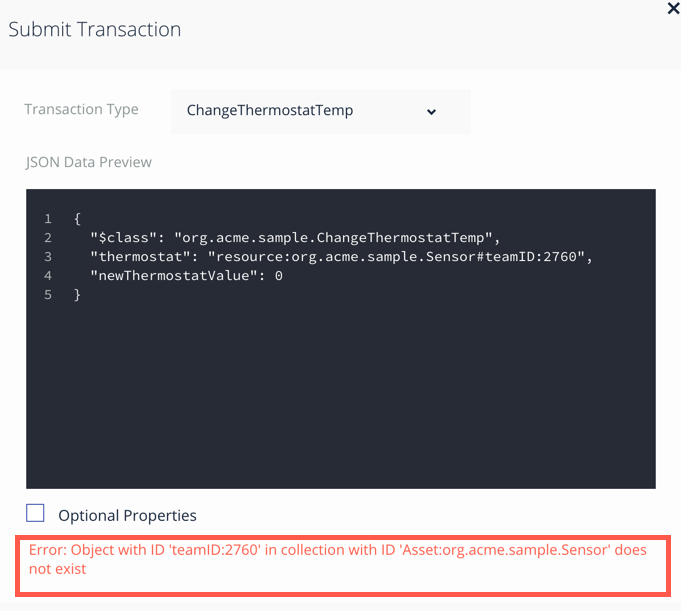

39. Verify that the last transaction updated your asset. Click **Sensor**.

    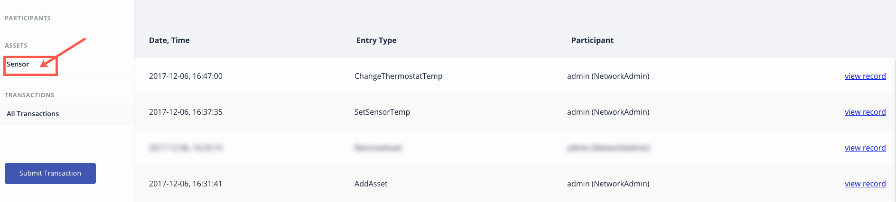

40. Verify that the `thermostatTemp` attribute for your Team has been updated to the value you gave successsfully in the `ChangeThermostatTemp` transaction.

    * **Note**: In step 40, you can verify that the thermostat was originally set to 20 and is now set to 16.

      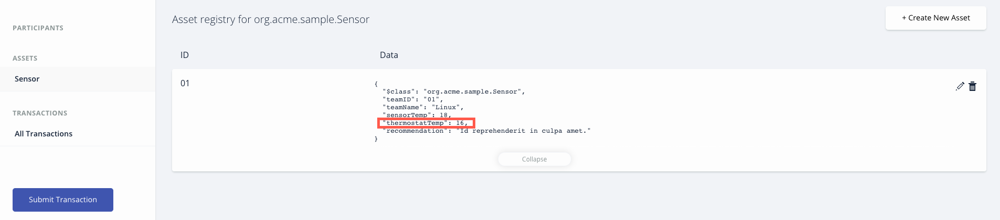

41. Time to work with the `CompareWeather` transaction. Click **Submit Transaction**.

    

42. Select **CompareWeather** from the *Transaction Type* drop down.

    

43. Complete the **CompareWeather** transaction.

    * Modify the JSON, `"recommend": "resource:org.acme.sample.Sensor#xxxx"`— Replace **xxxx** with your team ID.

    * Modify the JSON for`"outsideTemp": 0`— Enter a value for an outside temperature.

    * Edit the JSON for`"feelsLike": 0` — Enter a value for what temperature it could feel like outside.

    * Click **Submit**.

      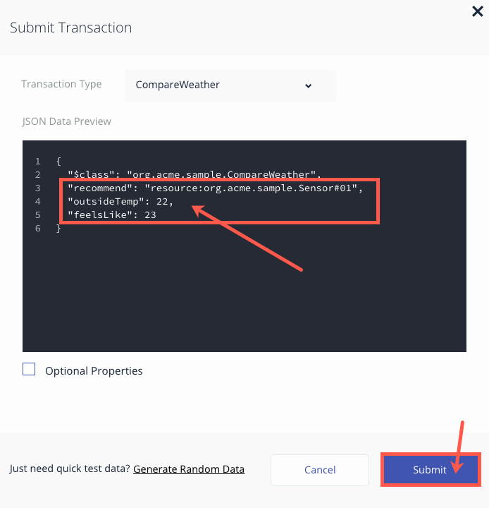

44. Verify that your transaction is showing in the Transaction Registry.

    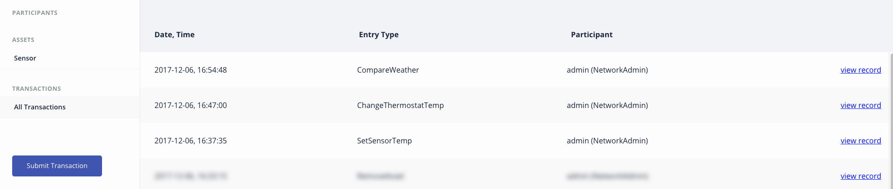

45. Click on **Sensor**.

    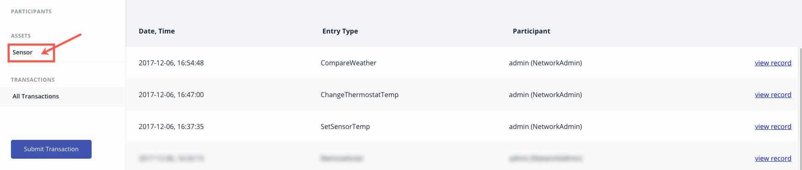

46. Verify there is now a message in the `recommendation`variable in your Team asset and that the `thermostatValue` has been updated to the recommended value.

    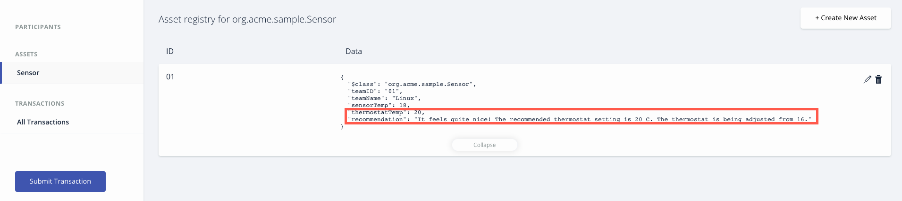

47. Continue testing your code for all scenarios to understand what your contract(s) can do. The hints to the remaining scenarios are as follows: (Yes, you'll have to look at the Script File under the Define Tab to figure out the criteria.)

    * ChangeThemostatTemp:
      - [ ] A successful transaction where the `thermostatValue` is updated in the Sensor asset.
      - [ ] An error message in the *Submit Transaction* window advising you do not have permission to adjust the thermostat.
    * CompareWeather:
      - [ ] A transaction based on `outsideTemp` values where it is really hot.
      - [ ] A transaction based on `outsideTemp` values where it is quite nice.
      - [ ] A transaction based on `outsideTemp` values where it is cold.
      - [ ] A transaction based on `feelsLike` values where it hot.
      - [ ] A transaction based on `feelsLike` values where it is quite nice.
      - [ ] A transaction based on `feelsLike` values where it is cold.

    * **Note:** You should verify that your asset values have been updated appropriately after each transaction like you did in prior steps.

#### Deploy application to Hyperledger Fabric

48. Back in your browser where Hyperledger Composer Playground is running, **click** the *Define* tab and then **click** *Export* to save your code to your desktop. This is a safety measure. Export saves all of the indivudual files we imported at the beginning of Part 2 into a compressed file called a business network archive (.bna).
   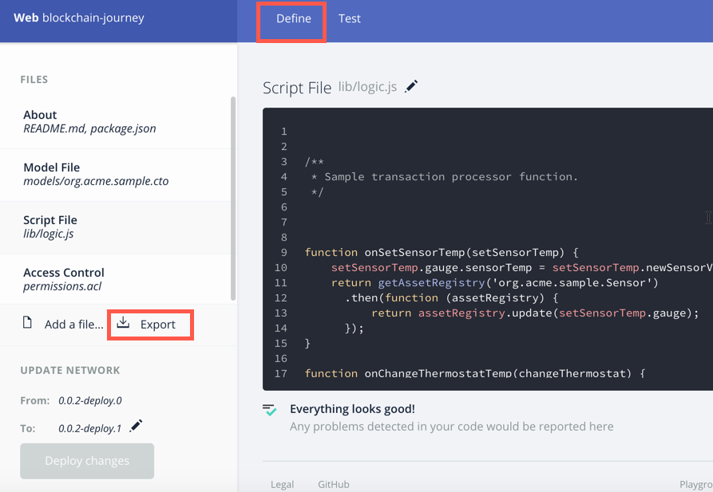

49. In the pop-up dialog, **choose** your directory location and **click** *Save*.
   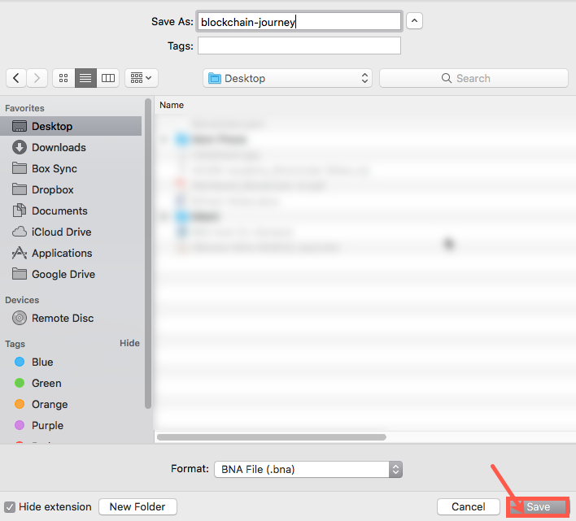

50. In the upper right corner of your browser, **select**  *admin* and **click** *My Business Networks*.
   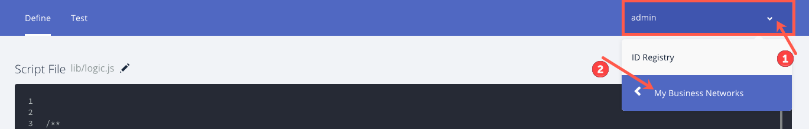

51.  In the middle of the page, **click** *Deploy a new business network* under the *Connection: hlfv1* business network.

   

52. Complete the fields under *Basic Information* and then **click** *Drop here to upload or browse*.

    * Business Network: `hlfv1-blockchain-journey`
    * Description: "Blockchain Journey network deployed to hlfv1"
    * Network Admin Card: `admin@hlfv1-blockchain-journey`

    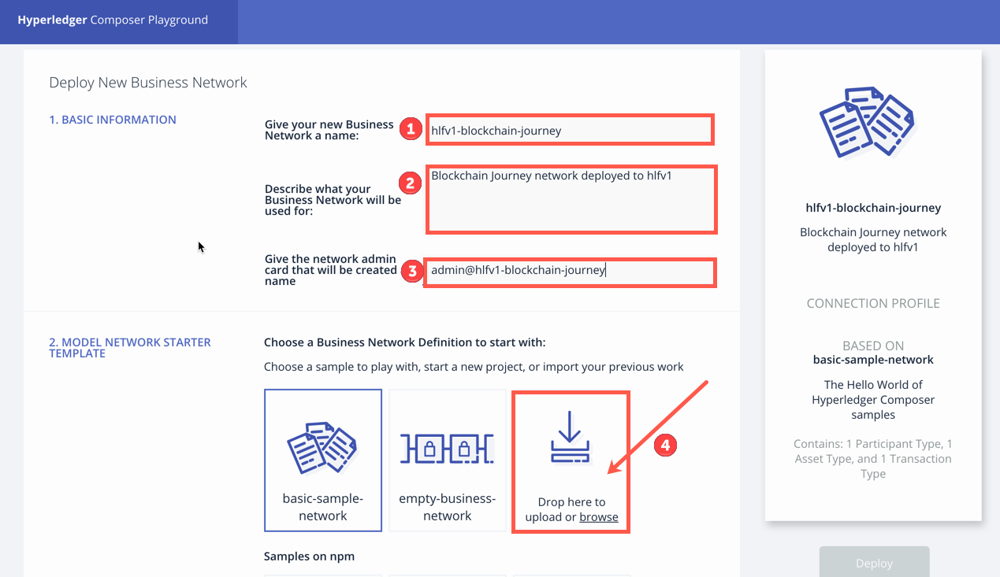

53. Navigate to where you saved your blockchain-journey.bna in step 49. **Select** blockchain-journey.bna from its directory and **click** *Open*.

    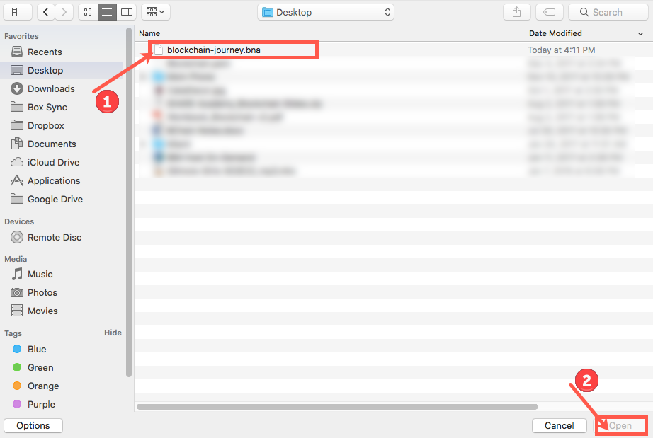

54. Scroll to the bottom of the page and complete the following:

    * **Select** *ID and Secret*.
    * **Create** an *Enrollment ID* of `admin`.
    * **Create** an *Enrollment Secret* of `adminpw`.
    * Note: If you create a different *Enrollment Id* and *Enrollment Secret* then you will need to create and import a network card for that ID. See [Hyperledger Composer documentation for more information.](https://hyperledger.github.io/composer//reference/composer.card.create)

    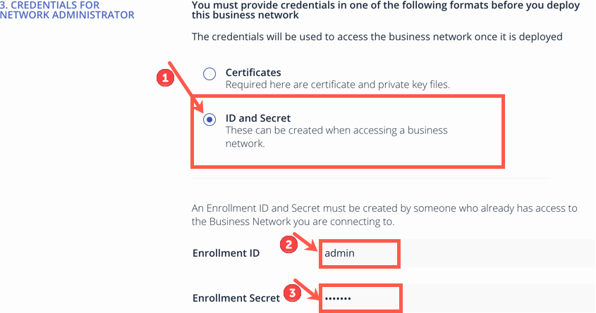

55. Scroll up to the top and **click** *Deploy* on the right side.

    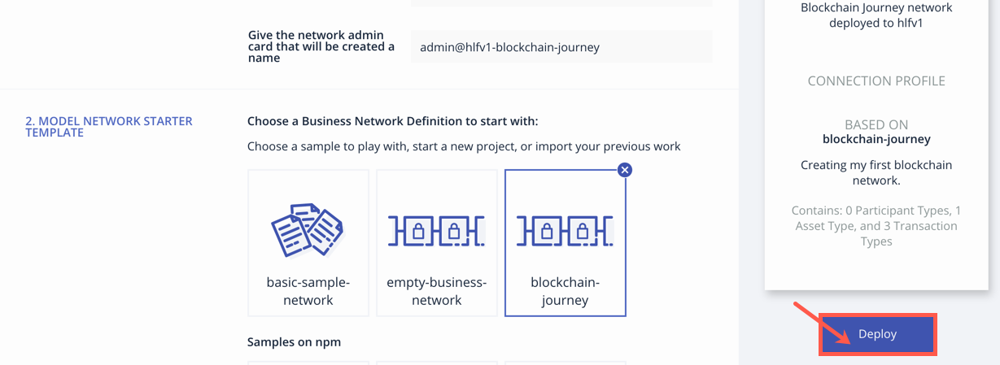

56. Under *Connection: hlfv1*, find your newly deployed network *hlfv1-blockchain-journey*. **Click** *Connect now*.

    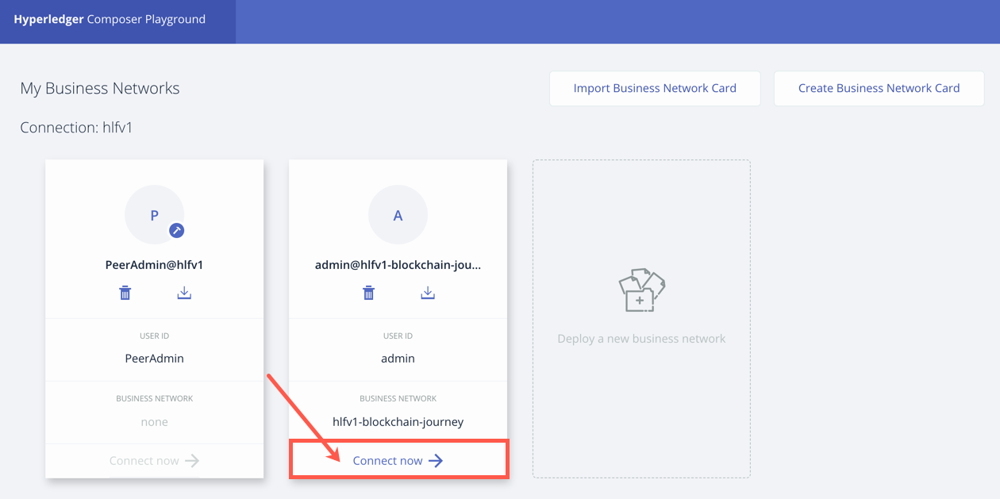

57. Back in your terminal, enter `docker ps -a` . You can see there is now a new container running where Composer Playground has deployed code to the Hyperledger Fabric.

    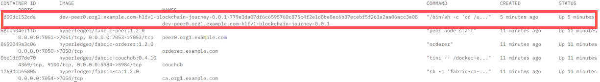

58.  Congratulations! You've deployed your first blockchain application to Hyperledger Fabric.

    #### Generating API

63. In your terminal, issue the following commands to start the API rest server:

    *  `mkdir /data/linux1/playground`

    * `nohup composer-rest-server -c admin@hlfv1-blockchain-journey -n always -w true >/data/linux1/playground/rest.stdout 2>/data/linux1/playground/rest.stderr & disown`

      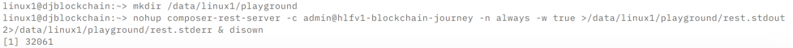

64. Verify the rest server process is running. `ps -ef|grep rest`

    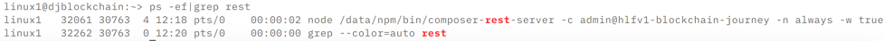

65. To see your API, go back to your browser and open a new tab or window. In the address bar, enter `http://xxx.xxx.x.x:3000/explorer` where the x's are the IP address for your Linux guest. You should see a page like the one shown.

    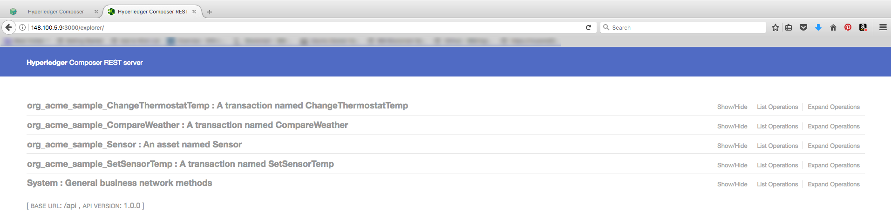

66. Expand the different methods to see the various calls and parameters you can make through REST API. You can also test the API in this browser to learn how to form the API and see the responses.

    

67. Congratulations! You now have a working blockchain application and have created APIs to call your blockchain application.

### Part 3 — Utilizing blockchain API through NodeRED

#### Importing your flow into NodeRED
1. Open NodeRED in your browser in a new tab or window. Enter `http://xxx.xxx.x.x:1880` in the address bar where the x's correspond to your Linux guest IP address.

   * Note: You may need to use a browser other than Chrome for Node-RED. There have been intermittant issues with Node-RED loading properly in Chrome.

   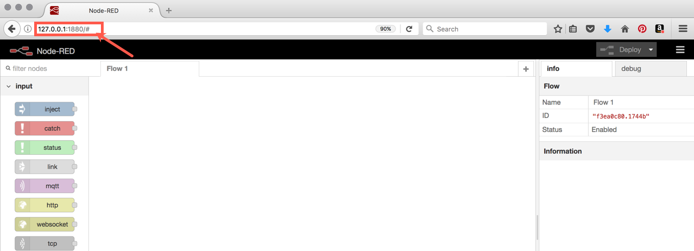

2. You'll need to add a few more nodes to your NodeRED palette to have complete working flows. To do this, **select** the *menu* button in the upper right corner.

   

3. **Select** *Manage Palette* from the drop down menu.

   

4. In the *User Settings* window, **click** *Install*, **type** `dashboard` in the search bar and select **install** next to *node-red-dashboard*.

   

5. In the *Install nodes* pop-up, **click** *Install*.

   

6. Now it's time to install a RaspberryPi Sense Hat simulator. In the *User Settings* window under *Install*, **type** `sense` in the search bar and select **install** next to *node-red-pi-sense-hat-simulator*.

   

7. In the *Install nodes* pop-up, **click** *Install*.

   

8. One more node to add, **type** *weather* in the search dialog and **select** *install* next to *node-red-node-weather-underground*.

   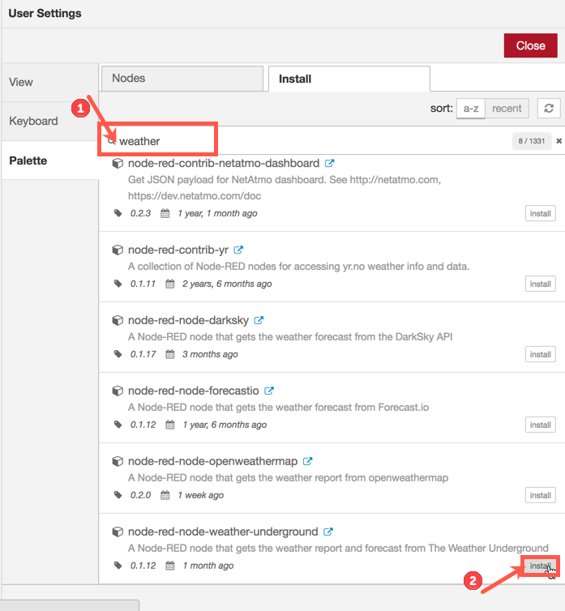

9. In the *Install nodes* pop-up, **click** *Install*.

   

10. **Click** *Close* to leave the User Settings dialog.

 

9. **Copy** all of the JSON from the [GitHub repository](https://raw.githubusercontent.com/BlueBarricade/hlfv13-on-s390x/master/code/node-red.json) to import into the flow.

    - **Note:** The easiest way to do this is clicking the hyperlink above. You can also find it in the GitHub repository in the code folder as `node-red.json`. To view it in GitHub, **click** on *node-red.json*, **select** *raw* and then copy it.

10. Paste it into NodeRed, by **clicking** on the *menu icon* in the upper right corner.

11.  **Select** *Import -> Clipboard*.

12.  **Paste** the code in the editor. Make sure to **select** "current flow" button. **Select** *Import*.

13.  You should now have three flows in NodeRED — Blockchain, Dashboard and Gauge.

14. On the right side of the Node-RED browser, **click** *Deploy* to save the work you've imported.

#### Interacting with blockchain through a dashboard

15. **Click** the *dashboard* tab in the upper right corner under *Deploy*.

    

16. **Click** the *pop out* button to open the dashboard in a browser.

    

17. A new tab should open. Your dashboard should look like the following image.

    

18. To interact with your simulated RaspberryPi, go back to your Node-RED tab and **select** the *Gauge Simulator* tab.

    

19. **Click** on the *Sensor Gauge Simulator* node.

    

20. On the right side of the browser, **click** on the *Info* tab.

    

21. In the third paragraph under Information there is a hyperlink for the word *here*.  That hyperlink opens the simulator in a new tab. **Click** *here*.

    

22. **Adjust** the temperature of the sensor in the simulator from 20 C.

    

23. Switch to the tab for your dashboard, **click** *Get Sense Hat Temperature* to see the change to the sensor temperature and graph.

    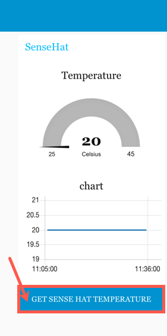

24. Continue to play with your dashboard to interact with blockchain via API. You can try the following:

    * Type in a team name & click *Add Team Name*. You should see a successful message afterward.

      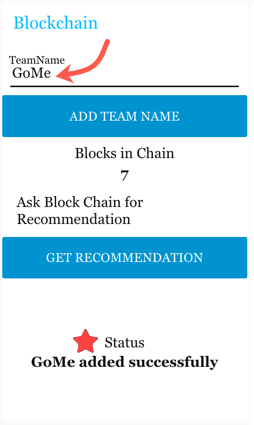

      ​

    * Change the thermostat by moving the slider next to *Thermostat Value*. Click *Change Thermostat*  to send the value to blockchain.'

      '

      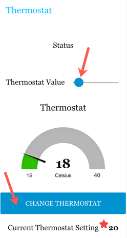

    * Type in a City and State to find outside temperatures. Click *Get Current Temps* to get the values.

      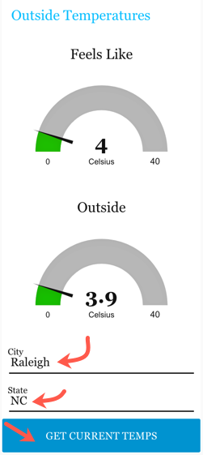

    * After you have outside temperatures, you can click *Get Recommendation* to find the ideal temperatures for the thermostat. Notice that this will adjust your thermostat in the dashboard.

    * 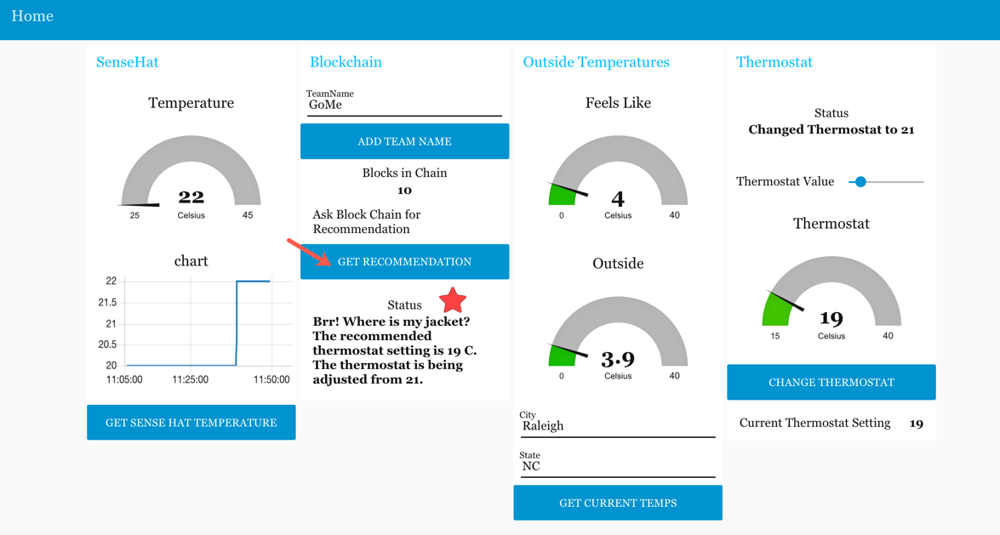

25. Congratulations! You've completed this journey!
